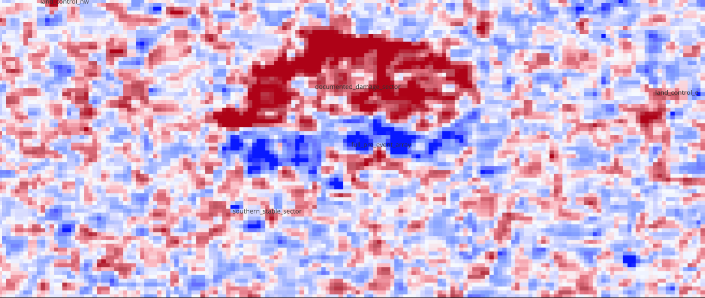

# QGIS raster laboratory

This folder preserves the visual GIS work that led to the controlled
cross-sensor benchmark. It is an auditable laboratory, not an alternative
calculation engine.

## Included projects and rasters

| Asset | Role |
|---|---|
| `qgis/projects/omkareshwar_sentinel1_pilot.qgz` | Multi-date storm-screen project. |
| `qgis/projects/yamakura_positive_event_pilot.qgz` | Positive structural-change project. |
| `qgis/rasters/orbit_39_*_vv_*.tif` | Real Yamakura pre, post and post-minus-pre dB rasters. |
| `qgis/rasters/o171_*_vv.tif`, `*_vh.tif` | Real Tengeh dual-pol temporal pair used by the injection demonstration. |
| `qgis/rasters/*_fpv_mask.tif` | Optical-derived FPV masks for all three comparison sites. |
| `qgis/rasters/nisar_track084_2026-07-02_rgb.tif` | Worldview RGB feasibility raster; not a calibrated benchmark input. |

## Reconstructing a difference raster

1. Open the Yamakura QGIS project.
2. Confirm that pre and post rasters share the same extent, resolution and CRS.
3. Open **Raster → Raster Calculator**.
4. Calculate `post@1 - pre@1` and save a GeoTIFF.
5. Style it with a diverging blue–white–red ramp centred on zero.
6. Overlay the pre-event array, documented damage sector, stable internal
   sector and stable-land control polygons.
7. Treat the difference image as spatial evidence—not a displacement estimate.

## Why QGIS mattered

QGIS answered three questions before automation: is the target visible in the
raster stack; does apparent change localize to the documented array sector
rather than the whole reservoir; and are orbit, polarization, CRS, extent and
sign conventions behaving as expected?

The quantitative MD curves were generated from the locked Python engine, not
by manually measuring the colourized difference image.

## Important boundary

The included NISAR RGB GeoTIFF is a rendered Worldview visualization. It is
useful for geographic inspection but is not equivalent to a native HHHH/HVHV
GCOV covariance layer. Calibrated GCOV inputs used in the final Kaggle run are
retrieved by the notebook and are not redistributed here.

