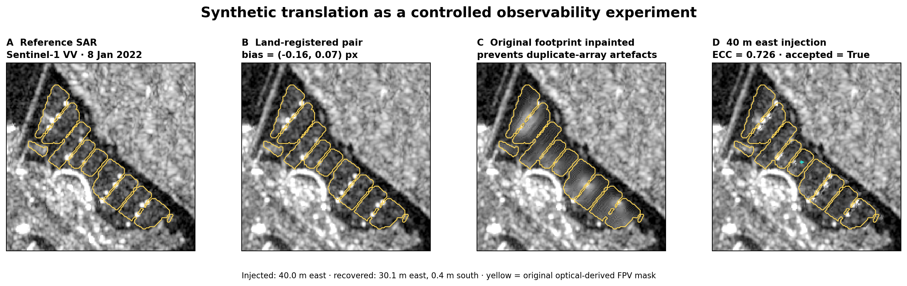
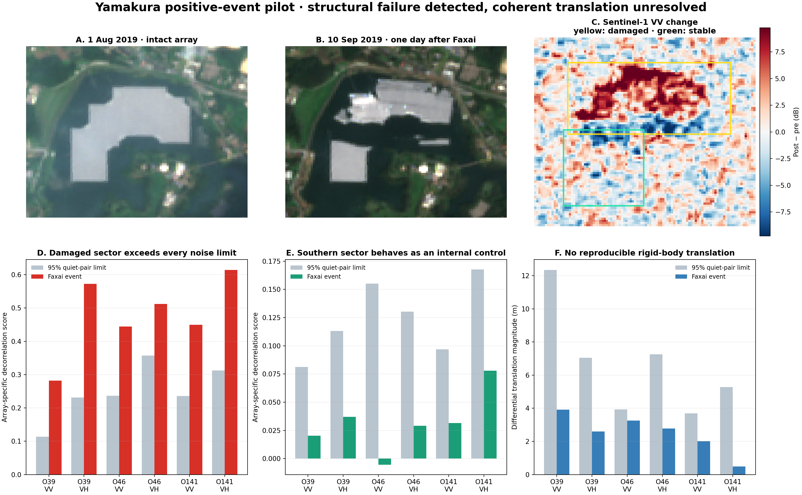
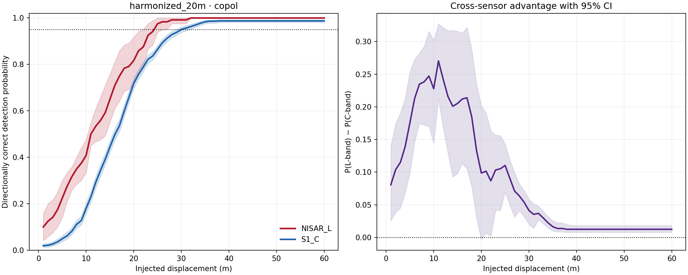
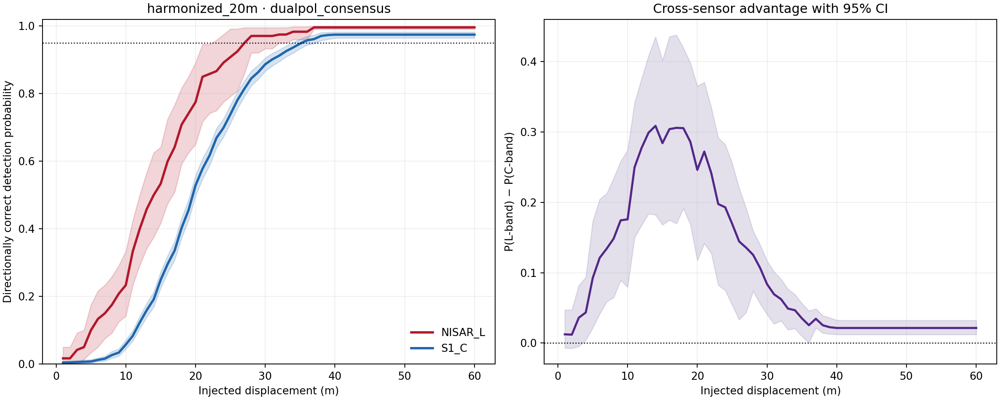
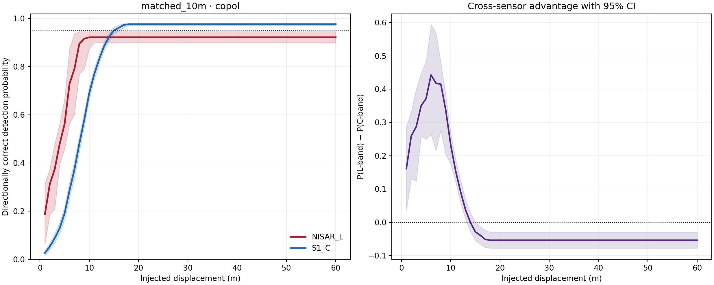
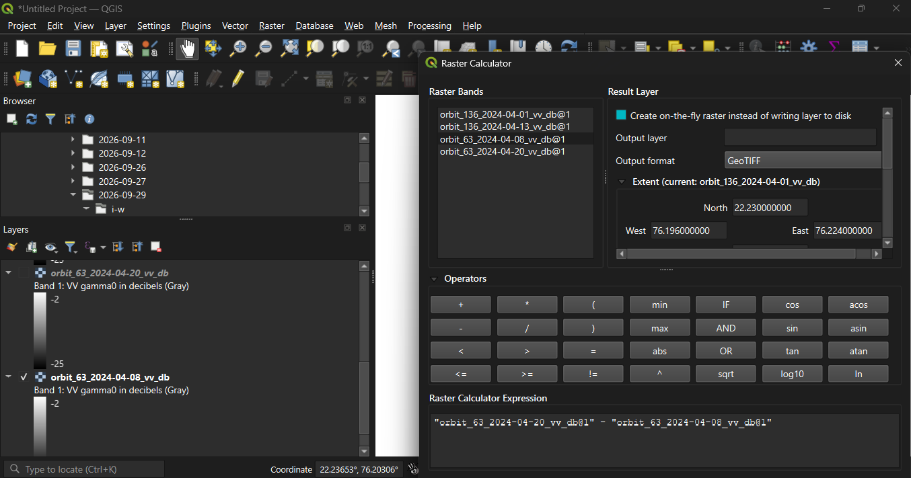
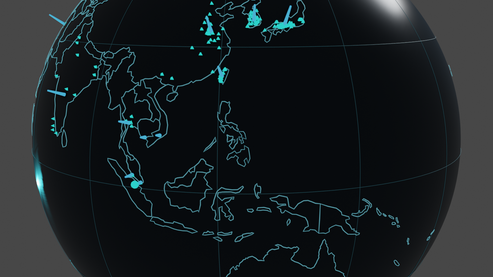

# Minimum Detectable Drift

### Initial cross-sensor observability bounds for floating photovoltaic motion in NISAR L-band and Sentinel-1 C-band SAR

web link for sandbox: https://mshrooom.github.io/Minimum-Detectable-Drift/

> **Research question:** after forcing early NISAR L-band GCOV and historical Sentinel-1 C-band RTC observations onto the same spatial grids and applying one frozen detector, how much persistent floating-photovoltaic (FPV) translation is required before its direction is recovered reliably?

**TL;DR:** I wanted to know whether radar can see a floating solar array move. I ended up measuring something more useful: how far an array has to move before a given sensor and detector can recover which way it went. At a 20 m grid, the pooled 95% boundary was about **25 m for early NISAR L-band** and **30 m for Sentinel-1 C-band** (co-polarized). The NISAR sample is small (15 test pairs vs 270), so these are **initial bounds, not a mission ranking**.

**[Open FPV Earth, the 3D observatory →](https://YOUR-USERNAME.github.io/fpv-cross-sensor-observability/)** · **[Open the raster atlas →](https://YOUR-USERNAME.github.io/fpv-cross-sensor-observability/atlas.html)** · **[Read the technical report →](https://YOUR-USERNAME.github.io/fpv-cross-sensor-observability/paper.html)**

---

## The story in one minute

My first plan was a paper on whether SAR can detect motion in floating PV fields. These arrays are rows of near-identical modules on water, so a shift measured between two dates can look convincing and still be wrong: speckle, viewing geometry, reservoir conditions and imperfect georegistration can all move the apparent correlation peak.

I started by hand in QGIS:

- **Omkareshwar.** Fifteen Sentinel-1 scenes from two relative orbits bracketed the April 2024 storm. The event vectors stayed inside the limits of ordinary non-event pairs, so no storm displacement could be claimed.
- **Yamakura.** Seventy-eight dual-polarization Sentinel-1 scenes covered three relative orbits around Typhoon Faxai. The documented damage sector exceeded every matched quiet-pair structural-change limit (6/6 channels), while the stable sector gave 0/6 and whole-array translation gave 0/6. The radar saw localized structural change, but no coherent translation I could resolve.

Those two cases changed the question from *"did this array move?"* to ***"how far must an array move before this sensor-detector system can resolve it?"*** The evidence wasn't strong enough for a paper, so I turned it into a reproducible benchmark with its limits visible.

---

## Abstract

Optical-derived FPV masks at Piolenc (France), Sirindhorn (Thailand) and Tengeh (Singapore) were combined with NISAR L-band GCOV and Sentinel-1 C-band RTC rasters. Temporal pairs were split chronologically into calibration (60%) and untouched test (40%) blocks, with no acquisition shared across them. Stable land estimated registration nuisance motion. After the original footprint was inpainted, known translations of 1 to 60 m were injected in eight directions and masked ECC alignment recovered each vector.

At the primary 20 m grid, pooled co-polarized MD50/80/95 values were **11/20/25 m for NISAR** and **17/23/30 m for Sentinel-1**. Dual-polarization consensus gave **14/21/27 m** and **20/27/36 m**. The apparent L-band advantage was not universal: Tengeh favoured Sentinel-1 in the co-pol analysis and tied at dual-pol MD95. NISAR contributed only 15 test pairs against 270 for Sentinel-1.

---

## Hypothesis and its rival

NISAR L-band has a wavelength of about 24 cm. The working hypothesis was that its longer-wavelength response might stay more persistent across FPV dates than C-band, lowering the translation-detection boundary when pixel spacing and the detector are held fixed.

The rival hypothesis was that wavelength matters less than source spacing, array morphology, viewing geometry, local clutter and pair quality. It predicts mixed site-level results even when pooled curves separate.

The results support neither extreme: pooled curves lean toward L-band, but the Tengeh reversal shows that **band is one term in an observability system**.

---

## Results

| Primary 20 m detector | NISAR L (MD50 / 80 / 95) | Sentinel-1 C (MD50 / 80 / 95) |
|---|---:|---:|
| Co-polarized | **11 / 20 / 25 m** | **17 / 23 / 30 m** |
| Dual-pol consensus | **14 / 21 / 27 m** | **20 / 27 / 36 m** |

`MDxx` is the first injected displacement where the monotonic fitted curve reaches `xx%` directionally correct recovery. Pooled NISAR MD95 95% intervals are 22 to 26 m (co-pol) and 23 to 32 m (dual-pol). Values reported as `not_reached` are never extrapolated beyond the tested 60 m range.

| Site | Test pairs L / C | Co-pol MD95 L / C | Dual-pol MD95 L / C |
|---|---:|---:|---:|
| Piolenc, France | 6 / 129 | **25 / 32 m** | **24 / 38 m** |
| Sirindhorn, Thailand | 3 / 92 | **24 / 30 m** | **25 / 30 m** |
| Tengeh, Singapore | 6 / 49 | **25 / 21 m** | **32 / 32 m** |

Site results are point estimates only, and all three NISAR site strata fail the prespecified independent-pair adequacy target of 10 test pairs (see `data/derived/power_audit.csv`).

  
  

**The exploratory 10 m regime.** Sentinel-1 reached co-pol MD95 at 15 m and dual-pol MD95 at 20 m. The NISAR subset reached MD50/MD80 at 5/8 m (co-pol) and 6/8 m (dual-pol), but MD95 was not reached through 60 m. Only six pairs from one site met the 10 m source-spacing rule, so this is a sampling warning, not evidence that L-band fails.

---

## Method

1. **Lock the split first.** Pairs are ordered chronologically within each sensor, site and geometry. The earliest 60% calibrate thresholds and the later 40% form the test block. The preparation audit shows 678 unique pairs (393 calibration, 285 test) and an empty cross-split overlap list.
2. **Common grids.** Two regimes were defined before inference: `matched_10m` (source spacing no coarser than 12.5 m, resampled to 10 m) and `harmonized_20m` (no coarser than 25 m, resampled to 20 m). The 20 m regime is primary because it retains all three NISAR sites.
3. **Cancel registration drift.** Four stable-land control boxes at fixed positions are converted to dB, high-pass filtered and registered with bidirectional phase correlation. The median accepted control shift is removed from the comparison raster.
4. **Controlled translation.** Real array pixels are selected by the optical mask, the footprint is inpainted (Telea), and the pixels are translated by every integer metre from 1 to 60 m in eight directions (0°, 45°, up to 315°). Ground truth is exact, while speckle, geometry and clutter stay real.
5. **Frozen detector.** Masked, high-pass ECC alignment recovers the shift. A recovery requires accepted registration and ECC quality, a magnitude above a calibration-only 95th-percentile threshold, and angular error of 45° or less. The dual-pol consensus detector requires both channels to alarm and agree within 45°.
6. **Uncertainty.** Recovery curves are made monotonic with weighted isotonic regression. Intervals come from 5,000 bootstrap iterations that resample whole acquisition pairs, preserving the dependence among the eight directions from one pair.

Implementation: [`src/cross_sensor_inference.py`](src/cross_sensor_inference.py). Full methods: [METHODS.md](METHODS.md) and [RESEARCH_REPORT.md](RESEARCH_REPORT.md).

---

## What this is and is not

**It is:**
- A method for estimating sensor-site-algorithm observability bounds, instead of interpreting one apparent vector.
- Preliminary pooled 20 m bounds for the available early NISAR sample under one frozen detector.
- Evidence that site dependence rejects a universal wavelength-only explanation.
- A reusable benchmark that reports `not_reached` instead of extrapolating.

**It is not:**
- Evidence that a real installation moved. The translations are synthetic and injected.
- A universal ranking of L-band against C-band.
- A measurement of centimetric phase displacement, or operational event detection.

### Limitations

1. NISAR provides 15 primary test pairs, against 270 for Sentinel-1.
2. NISAR site calibration blocks hold only three or four pairs each.
3. Rigid synthetic translation does not reproduce rotation, fracture, partial-block motion or changing reservoir interaction.
4. Amplitude tracking does not estimate centimetric phase displacement.
5. Masks are optical-derived approximations of array support.
6. Three sites are insufficient for global generalization.
7. No documented real event provides metre-accurate ground truth to validate the cross-sensor ranking.

---

## Audit trail

- 1,377 prepared scene records
- 678 unique temporal pairs (393 calibration, 285 test)
- zero calibration/test scene overlap
- 538,560 channel trials and 269,280 dual-pol consensus trials
- 5,000 acquisition-pair clustered bootstrap iterations
- automated self-test error of 0.0265 px

Every compact reported result is under [`data/derived/`](data/derived/) (data dictionary in [`data/derived/README.md`](data/derived/README.md)). The large trial-level tables are regenerated by the Kaggle notebook and excluded from Git. File hashes are in [`provenance/`](provenance/).

`tests/validate_release.py` checks that the released tables and counts are consistent with each other. It does not test whether the detector is scientifically correct.

---

## From QGIS observation to controlled benchmark

The tracked QGIS package contains two editable `.qgz` projects, real pre-event, post-event and difference GeoTIFFs, FPV mask rasters, a representative Sentinel-1 VV/VH temporal pair and one NISAR Worldview RGB GeoTIFF (visualization only, not a calibrated input). See [QGIS_WORKFLOW.md](QGIS_WORKFLOW.md).

---

## Extras: FPV Earth and the Blender scene

**FPV Earth** is an interactive 3D observatory that keeps three evidence levels separate:

1. **Global catalogue.** All 643 records from the Nobre et al. (2024) survey (through April 2023). Usable coordinates exist for 517; the other 126 are counted but cannot be placed as points.
2. **SAR-calibrated benchmark.** Piolenc, Sirindhorn and Tengeh, where this repository measures displacement sensitivity.
3. **Event audits.** Yamakura and Omkareshwar, where change was inspected but metre-accurate displacement is unavailable.

The globe is global in catalogue coverage, not in motion inference. It does not imply that all installations are monitored, moving or current. Selecting a mapped record can query the nearest Sentinel-2 L2A acquisition through the public Planetary Computer STAC catalogue; that is an on-demand lookup, not a live camera.

An editable **Blender** scene in [`blender/`](blender/) contains the 517 mapped records, country-density columns, a 360-frame Earth rig and evidence-aware markers. Yamakura pulses as localized change, Omkareshwar as below detection, and only Tengeh is translated, replaying a controlled 40 m synthetic injection exaggerated 15,000x so it is visible at globe scale. These animations must never be relabelled as observed global FPV drift.

---

## Sources, data and licensing

- Global FPV catalogue: Nobre, R. et al. (2024). *A global study of freshwater coverage by floating photovoltaics.* Solar Energy, 267, 112244. https://doi.org/10.1016/j.solener.2023.112244
- Sentinel-1: Copernicus. NISAR: NASA-ISRO, accessed through NASA Earthdata. Full product and software references are in [REFERENCES.md](REFERENCES.md).
- Raw provider imagery is not redistributed wholesale. The small tracked raster examples are for workflow inspection; read [DATA_LICENSE.md](DATA_LICENSE.md) before reusing anything.
- Code is MIT licensed. Compact derived tables may be reused under CC BY 4.0 with attribution.

---

*This repository is a research portfolio, not a published or peer-reviewed paper. Feedback from SAR and remote-sensing practitioners is very welcome.*
